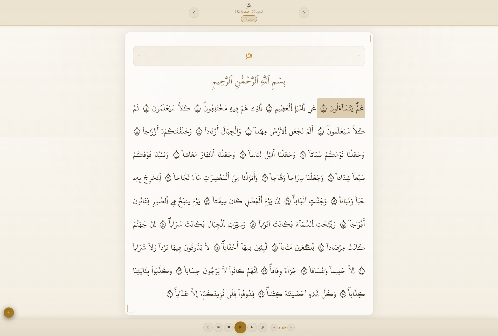
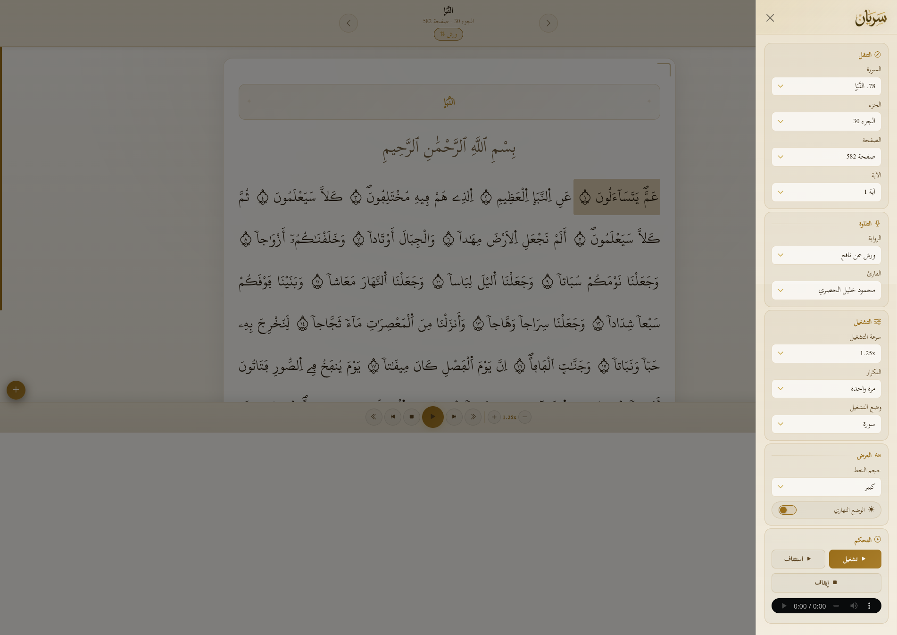

<p align="center">
  <a href="#" target="_blank">
    
  </a>
</p>
<hr/>

A lightweight, offline/online-friendly Mushaf **Warsh** web app (Arabic / RTL) that lets you browse the Qur'an by Surah, Juz', or Page and listen verse-by-verse audio with playback controls.

> 🌐 **Live site:** [warshana.pages.dev](https://warshana.pages.dev/)
> 📦 **Android APK:** [Download from Releases](https://github.com/zedsalim/warshana/releases)

## Screenshots

<p align="center">
  
  &nbsp;
  
</p>

## Features

- Navigate by Surah, Juz, Page, or Ayah from a sidebar
- Verse-by-verse audio playback (currently one reciter available)
- Play modes: ayah, page, surah, or juz
- Playback speed (0.5×–2×) and repeat controls (including infinite)
- Adjustable Qur'an text font size
- Active ayah highlighting with auto-scroll
- Settings persist via `localStorage` across sessions

## Running the App

You can use the app in three ways:

- **Online (no setup):** visit [warshana.pages.dev](https://warshana.pages.dev/) directly in your browser.
- **Android:** download and install the APK from [Releases](https://github.com/zedsalim/warshana/releases) _(enable "Install from unknown sources" if prompted)_.
- **Locally:** clone the repo and serve it yourself (required for offline audio).

### 1. Get the code

Clone the repo or download it as a ZIP:

```bash
git clone https://github.com/zedsalim/warshana
cd warshana
```

### 2. Serve it locally

The app must be served over HTTP — opening `index.html` directly won't work. Pick any of these:

```bash
# Python 3
python -m http.server 3000

# Python 2
python -m SimpleHTTPServer 3000

# Node.js (npx)
npx serve .

# VS Code
# Install the "Live Server" extension and click "Go Live"
```

Then open [http://localhost:3000](http://localhost:3000) in your browser.

## Offline Audio Setup

By default the app streams audio from online URLs. To use it **fully offline**, download the audio files and place them locally:

**1. Download the audio files**

Download the reciter folder(s) from Google Drive:
[📁 Download Audio — Google Drive](https://drive.google.com/drive/folders/10Iujd_rNoflXmSNfwkyPmmq9aOCLSejO?usp=drive_link)

**2. Place them in the right folder**

Extract / move the downloaded folder(s) into:

```
assets/
└── audio/
    └── abdelbasset_abdessamad/   ← folder name must match exactly
        ├── 001/
        │   ├── 001.mp3
        │   ├── 002.mp3
        │   └── ...
        ├── 002/
        └── ...
```

**3. Run the local server and enjoy offline**

The app automatically detects whether local audio files are present (via a single check per surah) and uses them. If they're missing it falls back to streaming online. No configuration needed.

## Keyboard Shortcuts

| Key          | Action                    |
| ------------ | ------------------------- |
| `Space`      | Play / Pause              |
| `ArrowLeft`  | Next ayah                 |
| `ArrowRight` | Previous ayah             |
| `0–9`        | Seek to 0%–90%            |
| `+` / `-`    | Increase / Decrease speed |

## Credits

- **Qur'an text (Warsh):** [King Fahd Glorious Qur'an Printing Complex](https://qurancomplex.gov.sa/quran-dev/)
- **Audio:** [VerseByVerseQuran.com](https://www.versebyversequran.com/)
- **Font:** Maghribi-style Uthmanic Warsh script (`uthmanic_warsh_v21.ttf`) By [King Fahd Glorious Qur'an Printing Complex](https://qurancomplex.gov.sa/quran-dev/)
- **UI framework:** Bootstrap 5 RTL

## Audio Verification

The Abdelbasset Abdessamad (Warsh) audio has been verified and aligned
with King Fahd Warsh v2-1 ayah boundaries.

📄 Full report: [AUDIO_ALIGNMENT.md](./AUDIO_ALIGNMENT.md)
