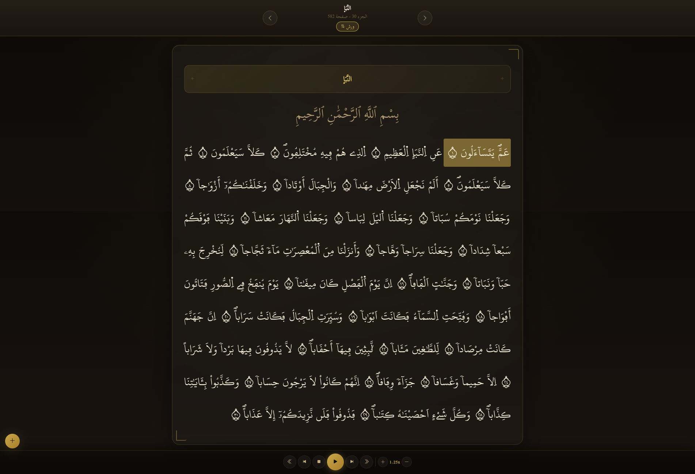

<p align="center">
  <a href="#" target="_blank">
    
  </a>
</p>
<hr/>

**English** | [العربية](./README.ar.md)

---

A lightweight, offline/online-friendly Mushaf web app (Arabic / RTL) supporting both **Warsh** and **Hafs** riwayas. Browse the Qur'an by Surah, Juz', or Page and listen verse-by-verse audio with full playback controls.

> 🌐 **Live site:** [sarayan.pages.dev](https://sarayan.pages.dev/)
> 📦 **Android APK:** [Download from Releases](https://github.com/zedsalim/sarayan/releases)

## Screenshots

<p align="center">
  
  &nbsp;
  
  &nbsp;
  
</p>

## Features

- **Two riwayas:** switch between Warsh (رواية ورش عن نافع) and Hafs (رواية حفص عن عاصم) instantly — click the badge in the header or use the sidebar selector
- Navigate by Surah, Juz, Page, or Ayah from a sidebar
- Verse-by-verse audio playback with multiple reciters per riwaya
- Play modes: ayah, page, surah, or juz
- Playback speed (0.5×–2×) and repeat controls (including infinite)
- Adjustable Qur'an text font size
- Active ayah highlighting with auto-scroll
- Toggle fullscreen reading mode
- Settings persist via `localStorage` across sessions

## Running the App

You can use the app in three ways:

- **Online (no setup):** visit [sarayan.pages.dev](https://sarayan.pages.dev/) directly in your browser.
- **Android:** download and install the APK from [Releases](https://github.com/zedsalim/sarayan/releases) _(enable "Install from unknown sources" if prompted)_.
- **Locally:** clone the repo and serve it yourself (required for offline audio).

### 1. Get the code

```bash
git clone https://github.com/zedsalim/sarayan
cd sarayan
```

### 2. Serve it locally

The app must be served over HTTP — opening `index.html` directly won't work. Pick any of these:

```bash
# Python 3
python -m http.server 3000

# Python 2
python -m SimpleHTTPServer 3000

# Node.js (npx)
npx serve .

# VS Code
# Install the "Live Server" extension and click "Go Live"
```

Then open [http://localhost:3000](http://localhost:3000) in your browser.

## Offline Audio Setup

By default the app streams audio from online URLs. To use it **fully offline**, download the audio files and place them locally under the correct riwaya subfolder:

**1. Download the audio files**

Download the reciter folder(s) from Google Drive:
[📁 Download Audio — Google Drive](https://drive.google.com/drive/folders/10Iujd_rNoflXmSNfwkyPmmq9aOCLSejO?usp=drive_link)

**2. Place them in the right folder**

Audio is organised by riwaya:

```
assets/
└── audio/
    ├── warsh/
    │   └── abdelbasset_abdessamad/   ← Warsh reciter folder
    │       ├── 001/
    │       │   ├── 001.mp3
    │       │   ├── 002.mp3
    │       │   └── ...
    │       ├── 002/
    │       └── ...
    └── hafs/
        └── abdelbasset_abdessamad/           ← Hafs reciter folder
            ├── 001/
            │   ├── 001.mp3
            │   └── ...
            └── ...
```

> ⚠️ Folder names must match the reciter keys defined in `RIWAYA_CONFIG` inside `script.js` exactly.

**3. Run the local server and enjoy offline**

The app automatically detects whether local audio files are present (via a single HEAD request per surah) and uses them. If they're missing it falls back to streaming online. No configuration needed.

## Text Data

Qur'an text is stored in `assets/text/` separated by riwaya:

```
assets/text/
├── warsh-quran.json         ← Warsh text (KFGQPC v2.1, Uthmanic verse numbering)
└── hafs-quran.json          ← Hafs text (KFGQPC v2.0)
```

Both files share the same JSON structure:

```json
{
  "id": 1,
  "jozz": 1,
  "page": 1,
  "sura_no": 1,
  "sura_name_en": "Al-Fātiḥah",
  "sura_name_ar": "الفَاتِحة",
  "line_start": 2,
  "line_end": 2,
  "aya_no": 1,
  "aya_no_marker": "ﰀ",
  "aya_text": "بِسْمِ اِ۬للَّهِ اِ۬لرَّحْمَٰنِ اِ۬لرَّحِيمِ"
}
```

The `aya_no_marker` field contains the KFGQPC PUA glyph (`U+FC00 + aya_no - 1`) used by Hafs. For Warsh, the app ignores this field and instead renders Arabic-Indic digits (e.g. `٣`) directly — compatible with the `warsh-v8-full` font and any standard Arabic font.

> The Warsh text is sourced from [fawazahmed0/quran-api](https://github.com/fawazahmed0/quran-api) (`ara-quranwarsh`, version 8, Uthmanic verse numbering). This edition replaces certain diacritic characters to conform to the Unicode standard (`U+0656→U+08F2`, `U+0657→U+08F0`, `U+065E→U+08F1`) and must be used with the matching `warsh-v8-full` font. Verse numbering has been aligned to the Uthmanic standard for cross-riwaya compatibility.

## Keyboard Shortcuts

| Key          | Action                    |
| ------------ | ------------------------- |
| `Space`      | Play / Pause              |
| `ArrowLeft`  | Next ayah                 |
| `ArrowRight` | Previous ayah             |
| `0–9`        | Seek to 0%–90%            |
| `+` / `-`    | Increase / Decrease speed |

## Credits

- **Qur'an text & fonts:** [King Fahd Glorious Qur'an Printing Complex (KFGQPC)](https://qurancomplex.gov.sa/quran-dev/)
  - Warsh font: `warsh-v8-full.ttf` — customised KFGQPC Warsh font via [fawazahmed0/quran-api](https://github.com/fawazahmed0/quran-api), tuned for the `ara-quranwarsh` text edition
  - Hafs font: `uthmanic_hafs_v20.ttf` (KFGQPC Hafs Uthmanic script)
- **Warsh source text:** [fawazahmed0/quran-api](https://github.com/fawazahmed0/quran-api)
- **Audio:** [VerseByVerseQuran.com](https://www.versebyversequran.com/)
- **UI framework:** Bootstrap 5 RTL
